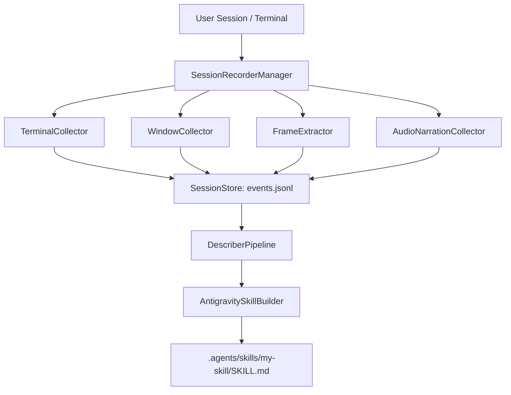

# Google Antigravity Skill Recorder CLI & GStack Engine 🚀

[](https://opensource.org/licenses/MIT)
[]()
[](https://www.typescriptlang.org/)
[](https://github.com/garrytan/gstack)

> **Record real-world developer sessions (CLI, window focus, screenshots, narration) and instantly synthesize them into production-ready [Google Antigravity AI Agent Skills](https://antigravity.google) (`SKILL.md`).**

---

## 💡 Overview

**Antigravity Skill Recorder CLI** (`agy-skill-recorder`) bridges interactive work sessions and agentic automation. It captures real-time developer workflows across terminals, application windows, screen snapshots, and audio narration, then uses a multimodal describer and builder pipeline to construct reusable Google Antigravity Skill Packages (`.agents/skills/<name>/SKILL.md`).

Built according to the **GStack** engineering standards (Role-based personas: *CEO, Engineering Manager, QA Lead, Designer, Security Officer*), this system is built for zero-fluff, production-grade agentic workflow generation.

---

## ✨ Features

- 🔴 **Multi-Signal Collectors**: Simultaneously captures CLI/PTY command traces, active OS windows, browser URLs, periodic screenshot keyframes, and voice notes.
- 🔒 **Privacy First & Zero-Secret Policy**: Strict local append-only event streams (`events.jsonl`) with traversal guards and automatic credential filtering.
- 🧠 **Multimodal Describer**: Chunks timeline events, correlates timestamps with screenshots, and derives intent, kind (action vs calculation), and tool requirements.
- 📦 **Antigravity Skill Builder**: Exports standard `.agents/skills/<name>/SKILL.md` packages complete with YAML frontmatter (`name`, `description`, `allowed-tools`), markdown execution steps, and helper scripts.
- 🩺 **Integrated Doctor**: Full system sanity check verifying runtime environments, PTY support, screen tools, and Antigravity paths.
- 🌟 **GStack Production Audit**: Built-in `gstack-review` command auditing product strategy, technical architecture, and quality assurance.

---

## 🛠️ Installation

```bash
git clone https://github.com/Bilal140202/antigravity-skill-recorder.git
cd antigravity-skill-recorder
npm install
npm run build
npm link
```

---

## 🚀 Quickstart Walkthrough

### 1. Run System Doctor
```bash
agy-skill-recorder doctor
```

### 2. Record a Session
```bash
agy-skill-recorder record -t "Deploy Application to Kubernetes"
```
*While recording, type interactive commands or add inline notes:*
```text
agy-recorder> note Make sure kubectl context points to production
agy-recorder> kubectl get pods
agy-recorder> stop
```

### 3. Analyze & Export to Google Antigravity Skill
```bash
# Analyze trajectory steps
agy-skill-recorder analyze 20260803-224926-b8e7ao

# Export SKILL.md package to current workspace
agy-skill-recorder export 20260803-224926-b8e7ao
```

Your generated skill is saved at `.agents/skills/deploy-application-to-kubernetes/SKILL.md` and immediately active in **Antigravity CLI (`agy`)**, **Antigravity IDE**, and **Antigravity 2.0 Desktop**!

---

## 🏗️ Architecture



---

## 🛡️ GStack Quality Audit

Run the built-in GStack quality verification:
```bash
agy-skill-recorder gstack-review
```

---

## 📜 License

[MIT License](LICENSE) © 2026 Ansari Mohammad Bilal
